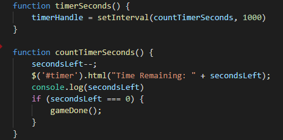

# UC Berkeley Fullstack Coding Bootcamp

# The Simpson's Trivia Game

## Overveiw:
This project was built with JavaScript, jQuery, HTML, and CSS. Most all of the HTML content is generated dynamically through JavaScript.

## How to play the game?
- When you click Start, you will be given 9 multiple-choice questions about The Simpsons.
- You have 60 seconds to answer all the questions before time runs out.
- If you finish early, you can quit sooner by clicking the Answer button.
- The game will hide this amount until the player clicks a crystal.
- When the game ends, your score will be displayed for you.

## Game in action: 

## Important code snippit: 
This particaular code generates the timer for the game.

## Currently working with:

- Html
- CSS
- JavaScript
- jQuery
- GitBash
- GitLab
- GitHub
- Timer

## Assignments (works in progress):

- [Profile](https://github.com/Mamitin/Basic-portfolio/blob/master/portfolio.html)
- [Portfolio](https://github.com/Mamitin/Basic-portfolio/blob/master/portfolio.html)
- [Contact](https://github.com/Mamitin/Basic-portfolio/blob/master/contact.html)
- [Wireframe](https://github.com/Mamitin/HW-Wireframe/blob/master/index.html)
- [Bootstrap Portfolio](https://github.com/Mamitin/Bootstrap-Portfolio/blob/master/index.html)
- [Crytal Collector](https://mamitin.github.io/unit-4-game/blob/master/index.html)
- [Simpson Trivia Game](https://github.com/Mamitin/TriviaGame)

## Contributing
Please find me on [Linkedin](https://www.linkedin.com/in/monica-amitin-58635475/).
]